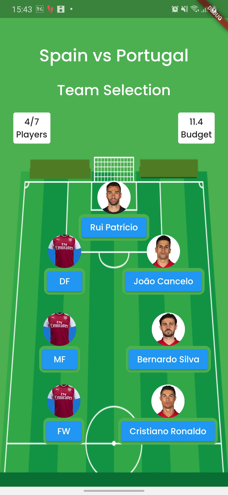
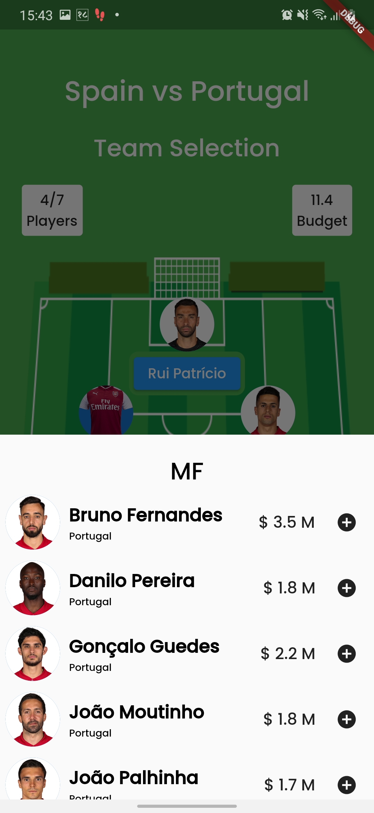

# Fantasy UI

A Flutter UI, previously made on vanilla javascript, html & css. I said why not and built it on Flutter.

## Demo

<div style="display:flex; flex-direction:column;">


</div>


## Tech Stack

Flutter, GetX for global state management and Material Ui.

## Run Locally

Clone the project

```bash
  git clone https://github.com/Software-Batch-2018/fantasy-ui-mobile-flutter
```

Go to the project directory

```bash
  cd fantasy-ui-mobile-flutter
```


Run Application

```bash
  flutter run
```


## Previous UI

 - [Euro Fantasy UI Html, CSS & Vanilla Javascript](https://github.com/Software-Batch-2018/Fantasy-UI)


